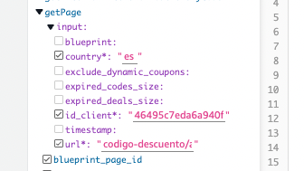
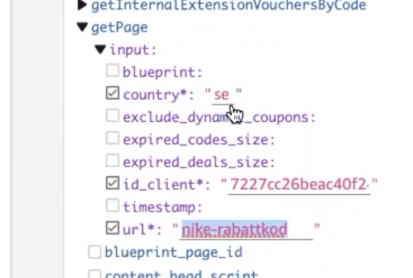

# How-To
Reborn project is a tool to render views capable of search for data models and use a desired User Interfaces to display custom content, as a platform allows to present different data with a singular styling according to the url of the partner that a user request.

From a global perspective could be seen as:
1. A Design System integrator, that make use of atomic components to render UI.
2. A dinamic SEO friendly and highly customizable single system to server-side rendering many different type of pages.
3. A Data Collector which resolve the data needed interacting with the server.

From a global perspective, It is possible to identify key parts into Reborn project:
1. How to Routing to Views
2. How to Display User Interfaces with Content
3. How to Search for Data Models

## How to Rendering Views
Static generation and server-side rendering of pages/
Static file serving through public/ which is mapped to the base URL (/)

### Routing
In Reborn dynamic routes are handled around the concept of Next.js pages, an exported file in the pages directory. In this case, inside the pages directory was added a subfolder named as [param], which is rendered when the user visits the application, then it is associated with the route based on clientId to any further page_type. Finally, there is a file associated at the subfolder as `[...url].tsx` as **template shell for each page_type**.

The template shell has three main functions to collect the data needed:
1. pageDataResolver: main data getter & loader
2. getStaticProps / getServerSideProps: server side data resolver
3. withWrapper : a React Context component that works as Container Component that handles allow to child atomic components to access the data. (see Container React Pattern)

### Layout
* Container Components
1. src/utils/withWrapper/indext.tsx
2. src/elements/pageSkeleton.tsx : structure + {children}
3. src/pages/[clientId]/[page_type]
4. src/elements/layouts/[page_type-layout]/[page_type-layout].tsx

### AppSync
1. region: ireland
2. section: queries
3. mandatory data: (quotes)
      1. country
      2. id_client
      3. url (section/retailer)
      4. example 
      5. example 

