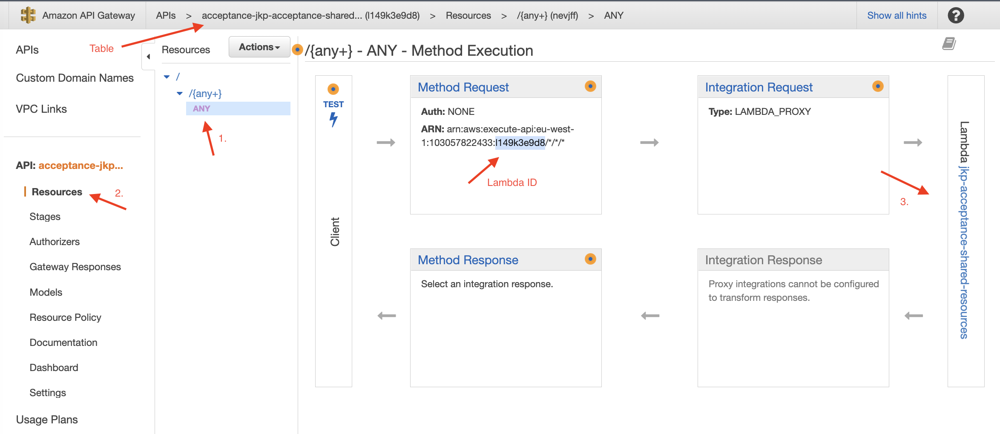
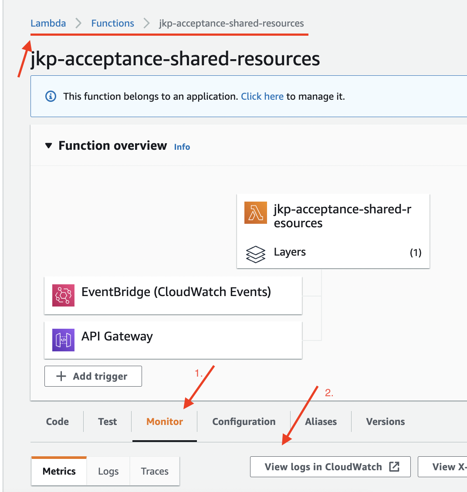
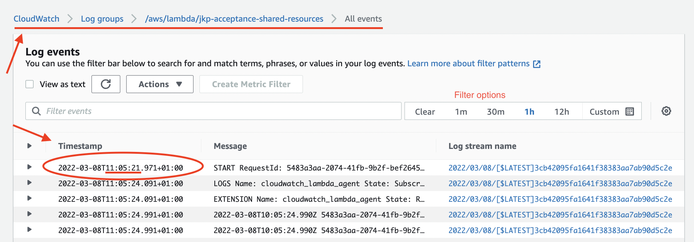
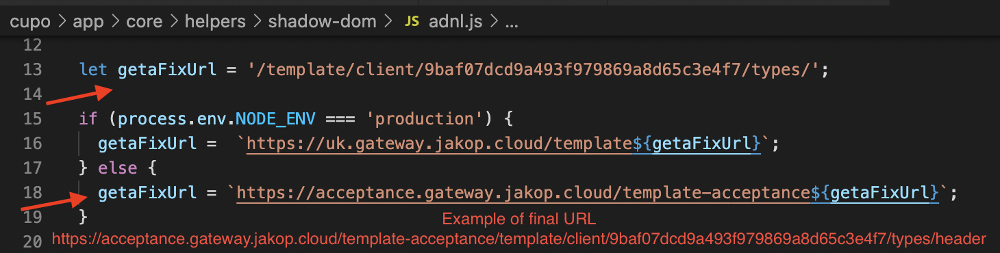
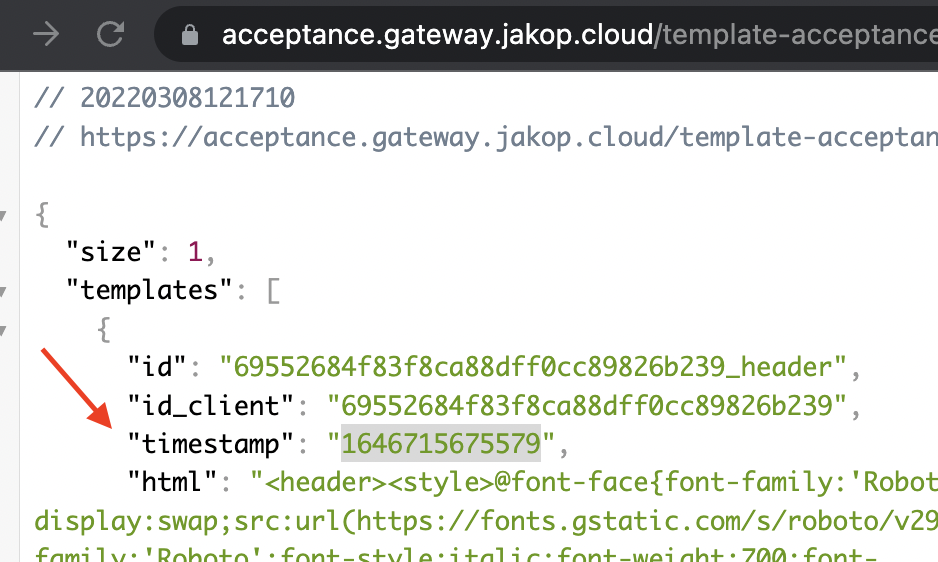

# Cache cleaning for shared-resource or How-To force new entries for DynamoDB
VEE and shared-resources api doesnt have any caching on it, some caches has nothing to do with template or shadow-dom.

shared-resources, the service which is deployed in aws, write DynamoDB making entries once a day, that it is called once automatically at 6AM for jkp-acceptance-template DynamoDB (template table).

In order to see latest updates, it's needed to **force a new entry with latest data to DynamoDB (template table), and then clear cache on template api gateway**.
1. force a new entry
2. clear cache

## 1. Force a new entry
There is a route to regenerate the data, this is to **force a new entry into DynamoDB in order to serve latest resource changes**.
* GET `https://l149k3e9d8.execute-api.eu-west-1.amazonaws.com/acceptance/generate-ve/[partner-id]/[element]`
  * e.g : *https:// l149k3e9d8.../8cc8ab53af4267041c949848276c37d7/header*

## 2. Clear Cache
There is a route to clear cache on template api gateway for DynamoDB (template table) `jkp-acceptance-template`
* https://eu-west-1.console.aws.amazon.com/apigateway/home?region=eu-west-1#/apis/1ll4lvbvs1/stages/acceptance

## Optional : aditional Checks
1. check lambda execution
   * Lambda ID : https://`l149k3e9d8`.execute-api...
   * Table : 
   * Lambda execution
     * 
     * 
   * check the entry for the resource
     * `https://acceptance.gateway.jakop.cloud/template-acceptance/template/client/[partner-id]/types/[element]`
     * this address is built with data from cupo-cuponing repo at > _cupo/app/core/helpers/shadow-dom/[partner]_ mergin both _getaFixUrl_ for the target environment, specifying the element at the end.
     
     * timestamp : 
2. S3 bucket (changes for VEE resources must be into content.html for `partner/[resource-type]/staging/content.html`) https://s3.console.aws.amazon.com/s3/buckets/wl-acceptance-vee-crawler?region=eu-central-1&tab=objects#

