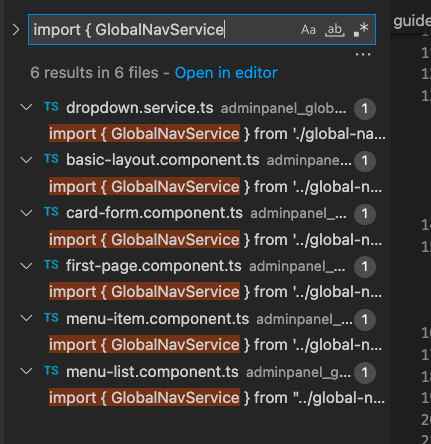
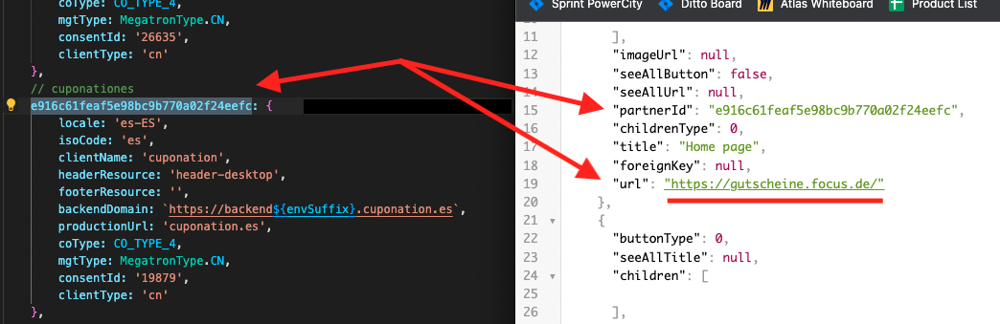
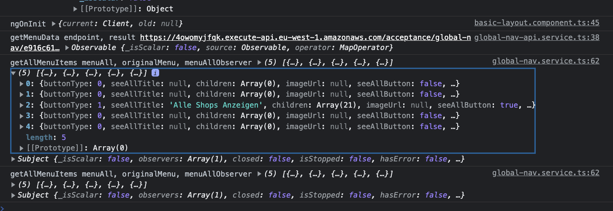

# Global Nav key points

1. [Data Entry Point](#data-entry-point)
2. [Components Entry Point](#components-entry-point)

# Data Entry Point
Global Nav use Angular Services to CRUD, processing and cleaning.

The Main Entry Point or layer (`global-nav-api.ts`) provides methods and properties as a toolbox for external comunication, then The Intermedium Layer implements those methods and properties provided as a toolbox to transport in a two-way flow data:
1. from components (UI) and user actions (CRUD) to the AWS server
2. from AWS server to components (UI) and user actions (CRUD) as initialization or result

## Main Entry Point
* Main Entry Point => `global-nav-api.ts`
* complexity: `saveMenu(newMenu, cliendID)`

## Component Service : The Intermedium Layer
Meanwhile the Main Entry point is the layer which provide the methods to comunicate with AWS directly, `global-nav.service.ts` is The Intermedium Layer which implements and uses those methods to receive data from the component and target to AWS calling the Main Entry Point methods.

It use the pattern of "Service in a Service" implementing the Main Entry Point in its constructor getting their methods and properties as yours to implement them at least once each.

1. saveMenu -> saveAllMenu
2. getMenuData -> getAllMenuItems
3. getPages -> getAllPages

> Most probably all the other methods and properties are 'processing helpers' to craft a 'menu data object'.

## Simulated data flow : Download Menu
1. The Intermedium Layer `global-nav.service.ts` implements The Main Entry Point methods `global-nav-api.ts`
2. Get all menu items of `getAllMenuItems` from getMenuData(this.cliendID)
3. If data && data.GlobalNav : Secondary Helpers
   1. Formatting Helpers
      1. menuData: MenuItem[] from types (array of objects)
      2. `this.formatMenu`(data.GlobalNav)
      3. Assign result to Class Property 1: `this.menuAll` = menuData;
      4. Assign Menu Items an ID
      5. Assign result to Class Property 2: `this.originalMenu` = [...menuData]
   2. Assign result to Class Property 3: this.menuAllObserver.next(this.menuAll) >>> `this.menuAllObservable`

If data && data.GlobalNav are true, then a real value is assigned to:
1. this.menuAll
2. this.originalMenu
3. this.menuAllObservable

Else case, those three are equal to an empty array.

Now we can see how the data is used by finding those files which implements `global-nav.service.ts`.

# Components Entry Point
The basic entry point for UI is `basic-layout.component.ts`. Data falls through to children as inherited properties within html components.

Imports `GlobalNavService` Class getting all their properties and methods to be able to do Mayor and Minor CRUD operations.

Mayor CRUD operations directly targets the Database as `saveAllMenu` like POST (which create and updates) and `getAllMenuItems` like GET (which reads). 

Minor CRUD operations manipulates data within the App level as helpers to perform crud operations over local data objects like properties, to be finally taken into mayor operations on further moments.

## Basic Layout Class

1. ngOnInit() : Pass Menu data before the view is rendered.
2. Imports GlobalNavService
3. Get Menu data : this.globalNavService.getAllMenuItems()
4. Assign Menu data to property (menuAll$) : this.globalNavService.menuAllObservable

## Shell : basic-layout.component.html

Along `basic-layout.component.html` sub-components are implemented:

1. `<app-first-page (changeEditMode)="createItem()"></app-first-page>`
      1. Display the green button to create an Item if
         1. menuAll$ was initialized and declared empty array
         2. touched is equal to false
         3. loading is equal to false

2. `<app-menu-list [menuAll]="menuAll$" [maxDepth]="maxDepth" [menuIsChanged]="menuIsChanged">`

      1. It receives server the data to be render
         1. [menuAll]="menuAll$"
         2. [maxDepth]="maxDepth"
         3. [menuIsChanged]="menuIsChanged"

3. `<app-card-form></app-card-form>`

      1. Card form used to Create/Edit item shown as a grey square at right

## app-first-page View : No Global Nav Items
`<app-first-page>` it's an image and a button that calls `createNewRootMenuItem()` class method

## app-menu-list View : Global Nav Items
`<app-menu-list>` is the parent of small children views. It's the Outer or Shell View to lower atomic elements as rows and buttons to Create/Cancel/Save changes.

The `<app-menu-list [menuAll]="menuAll$" [maxDepth]="maxDepth" [menuIsChanged]="menuIsChanged">` component implements children views as:

1. Buttons
2. __*ngFor into a li as host__ to loop over 'menu of menuAll'
3. `<app-menu-item>`
      1. [menuItemData]="menu"
      2. [currentDepth]="0"
      3. [maxDepth]="maxDepth"
      4. [indexInParent]="idx"
      5. (childDragged)="childDraggedHandler($event, idx)"
      6. (itemDeleted)="logger($event)"

# Conclusion
Now, just Cuponation ES is getting data it doesn't belongs to it. Global Nav is using the right client ID but server returns FocusDE data.

So, because this, the error where data is been misplacing has not to be Global Nav.

Log about the resul of the request.

