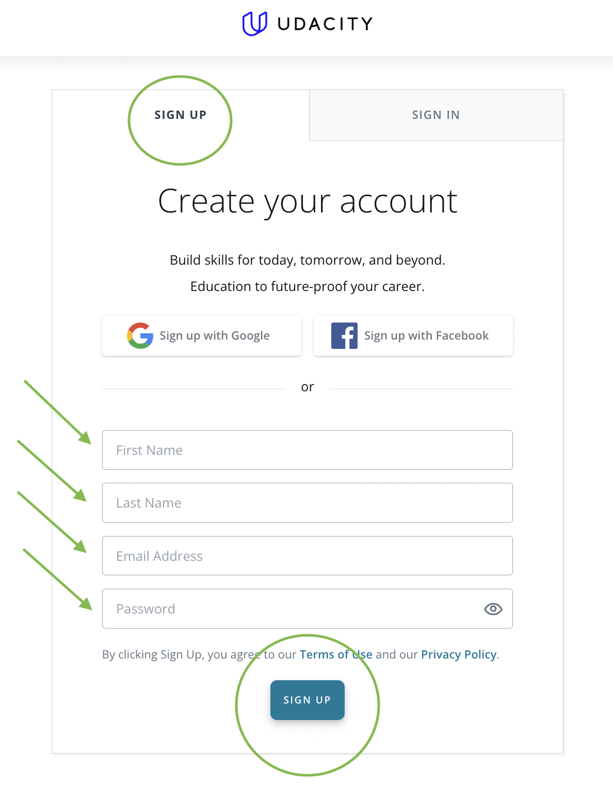
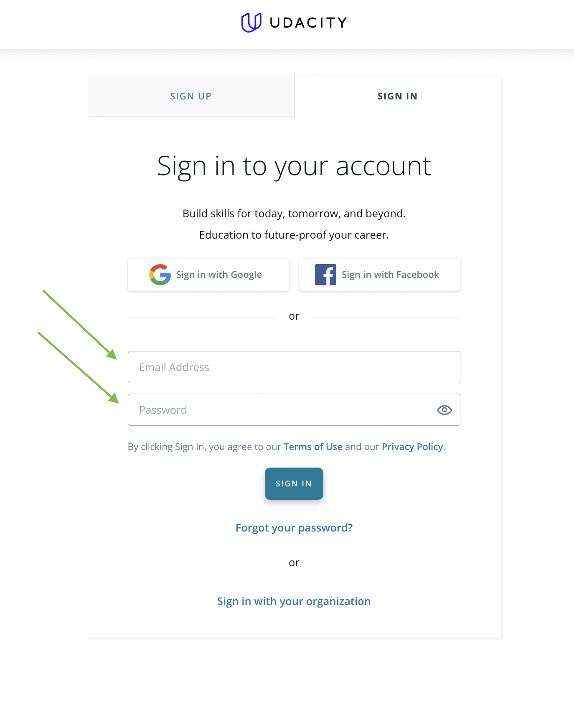
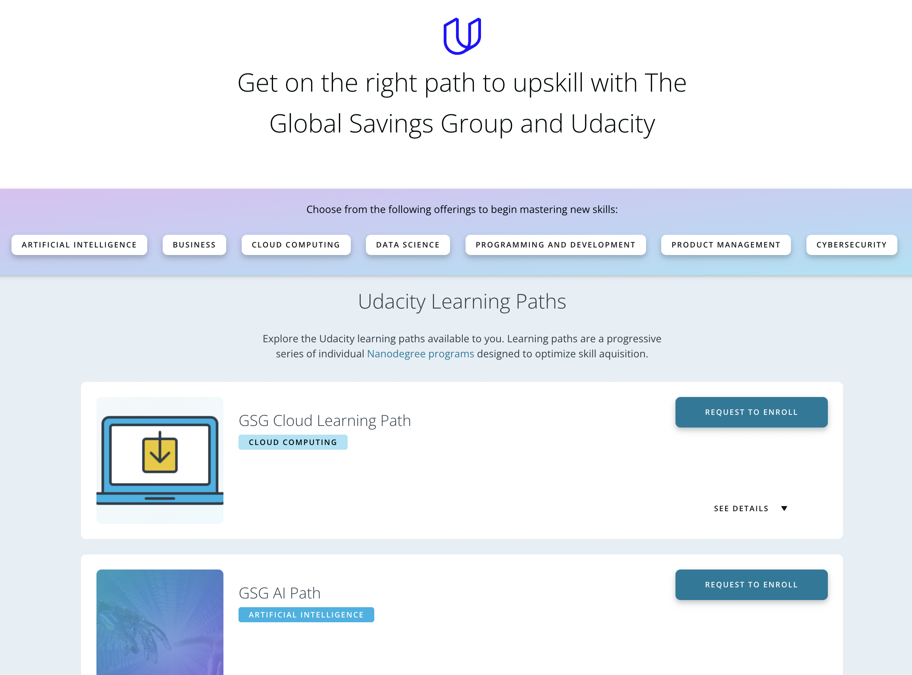
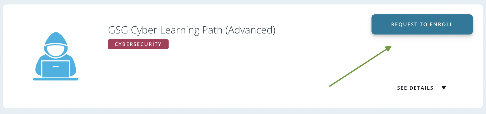
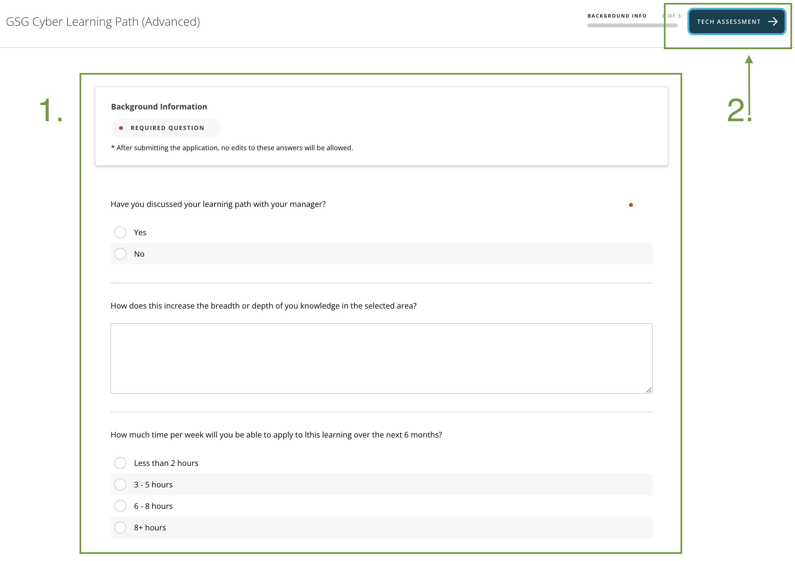

# Udacity
How-to guide step by step.

## Index
1. Udacity URL
2. Sign up (**¡¡¡Sign up manually!!!**)
3. Sign in (**¡¡¡Sign in manually!!!**)
4. GSG Catalog
5. Request to Enroll
6. Questions

## 1. Udacity URL
[Udacity GSG Catalog](https://emc.udacity.com/c/the-global-savings-group/catalog). 
If you're not logged you were redirected to sign/log in page

## 2. Sign up : **No Google Auth**
**¡¡¡Sign up manually!!!** Currently the _Google button NOT work_ properly, leading you [problematic quirky behaviours](#problematic-quirky-behaviours).

## 2. Sign in : **No Google Auth**
**¡¡¡Sign in manually!!!** Currently the _Google button NOT work_ properly, leading you [problematic quirky behaviours](#problematic-quirky-behaviours).

## 3. GSG Catalog
List and info about each Udacity Learning Paths

## 4. Request to Enroll
 

## 5. Questions
### 1. General Questions
### 2. Tech assesment ("placement test")
It is one assessment for the whole learning path (there are multiple assessments, but they overlap), it should recommend a list of nano-degrees you are ready for, including ones in different learning paths.

It is 45min/1hr placement test, could be quicker. Learner should allow that time to complete the assessment that must be complete before being approved to enrol an intermediate or specialist nanodegree.

Learners, can do multiple (different) assessments (they are free).

Foundational nanodegrees require no assessment.

A lerner is allowed to enroll only into those paths that the placement test reveal It is are prepared to.

> You can do one assessment, be ready to enrol on the intermediate course or do another assessment for a different path and choose before you are committed and enrol, or enter into any foundational level nanodegree.

## Troubleshooting
Known cases of errors.

### Problematic Quirky Behaviours
One known case of error happens If you sign up with google button, then your email get registered but the access to your account can't be achived.

Try this, go to "Sign in", then press "Forgot your password?", introduce your email, hit "Send Email". You should receive a "Udacity Password Reset" email to set a new password. After password reseting you will gain control of your account again.

Good luck!